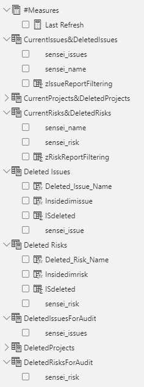

# Power BI Audit Report

An Audit report has been created that links into the Dynamics 365 audit feature and displays the data in a readable manner. 
This report links directly into Altus, it does not use a third party data warehouse.

For details on how to setup auditing in Altus, visit [here](https://hub.sensei.cloud/Docs/Altus/Configuration/Settings/Settings.html#how-to-enable-audit-logging-for-d365). 
Please make sure you understand the capacity limit of the client environment and their requirements before you turn any auditing on.

## Report Features
This Audit report has been setup to display items from the Project and Risks sections of Altus.
If you would like to add any additional sections to the report please review the how to instructions [here](#how-to-connect-additional-registers-to-the-audit-report)

__Data limitations:__
- As this report is looking directly at the data in Altus, if records are deleted, you will be able to see that items have been deleted but there is no way to display details on the deleted records as they no longer exist in the database.
- As the audit data that is provided through audit logging only displays IDs and look-up table references, rather than the values selected in the UI, any lists the client wants to see the value names for will need to be added to this report.

The limitations listed above will be able to be addressed when we are using a data warehouse to capture the Audit Data.

## Audit Report Files

You will need to download and install the following files:
 - [ Altus Audit Report](files/Audit_Model_Report.pbit)  
 - [ Audit Transactions Dataflow](files/Fact_Audit_Transactions.zip)  

To see details regarding how to install a dataflow in a workspace and update the PBIT with the parameters of the dataflow and workspace instructions can be found [here.](https://hub.sensei.cloud/Docs/Altus/Configuration/Reporting/Index.html#installing-the-json-files-in-the-client-environment)

## How To Connect Additional Registers to the Audit Report

In this example I will add the Issues Table to the report.

__Note:__ you will first need to turn on auditing on this table within Altus (instructions mentioned above) and changes will need to be made to data within the table so that Audit data has been recorded and is available to report on.

### 1. Add the new table to the Fact_Audit_Transactions dataflow:

1. Within the workspace, open the Fact_Audit_Transaction Dataflow.
2. Edit the dataflow.
2. Add the new table reference into the __#"Filtered rows__ query. For my example: <br />
```
     #"Filtered rows" = Table.SelectRows(Source, each [objecttypecode] = "sensei_project" or [objecttypecode] = "sensei_risk" __or [objecttypecode] = "sensei_issue"__),
``` 
3. Refresh the dataflow. You should see this new table data display in the __objecttypecode__ column.

4. Still within the dataflow. Create a query for this new table that will link each record to either a project, program or portfolio ID. (The easiest way of doing this is to copy the sensei_risk query that already has been built and modify it for the table you are adding)
   1. Connect to the new table in the environment
   1. Select the following columns within the table of the entity: the ID, the Project ID, Program ID, Portfolio ID (where appropriate)
   1. Create a conditional column that combines the Project/Program/Portfolio ID fields into one column
   1. Filter the new combined IDs column to remove any null values <br />
      <br />
   1. Open the Fact_Audit_Transactions query and merge your new table to it using a Left outer join, matching on the ___object_value__ column to the ID column from your new table (in my example sensei_issueid) <br />
    <br />
   1. Expand the table that was joined onto the Fact_Audit_Transactions table so any rows that match on your new ID display on this column 

   1. Save & close your changes and refresh the dataflow.
 

### 2. Updating the Power BI Audit Report

Once you have added the new table to the dataflow and refreshed it when you refresh the Power BI data you should see this data in the Fact_Audit_Transactions query in the report.

As the audit data does not contain details for the values, just IDs, you will need to bring in the data for the table you have just added so that the IDs can be matched to allow you to display data like the Issue Name in the report.

1. Add a Dim table to the report that displays the ID and name column to the report. In my example sensei_issueid and sensei_name from the sensei_issue table <br />

 <br />

1. Duplicate the Fact_Audit_Transactions query, appending it with the title of the table you have just added

1. For this new Fact_Audit_Transactions query, copy the joins to the existing Fact_Audit_Trasactions query, except for any Risk table joins <br />

 <br />

1. Recreate the following Measures within the report for your new entity linking to your new query and the new Fact_Audit_Transactions query:
    1. CurrentRisks&DeletedRisks
    1. Deleted Risks
    1. Deleted Risks for Audit <br />
 <br />

1. Join your new CurrentRisks&DeletedRisks table to the new Fact_Audit_Transactions query you created above.

1. Duplicate the Risk page of the Power BI report and update all the fields and filters that link directly to the Risk fields to point to your new fields.

 <br />
