# Paginated Reports Solution Starters

These SSRS reports have been created to compliment the Altus installation.
These reports use a Power BI data model rather than Fetch XML.

This Power BI data model has been created using a mixture of Dimensions and Direct Query, so that most of the data within the report is generated live and not subject to the normal Power BI refresh rates.
This Power BI Data model can be used for multiple reports in the client environment and can be added to by consultants.

This data model and paginated reports can be used to replace most historic SSRS reports.

Note: the biggest difference between using the new data model and Power BI Paginated Reports and creating an SSRS report from the Reporting Hub is the amount of flexibility you can build into the report directly. For example, the count cards on the Project Status Reports have all been created as measures in the Data model rather than directly into the report.

## Power BI Data Model
The Data Model has been created so that it can be reused for Project, Program and Portfolio Status Reports.

It is made up of a number of connections to the Power BI dimension tables (same as the Power BI BETA reports), direct SQL queries to data and measures built directly in the data model. 

The measures contain the following items:

__#Measures__: 
- Count fields, like Total Risks 
- SUM fields and calculations for Total Financials, like Budget, EAC 
- Current Project KPI Summary fields
- Previous Project KPI Summary fields

__Program Status KPIs__: 
- Program KPIs, current and previous
- Program summary fields

__Project Status KPIs__: 
- Project KPIs, current and previous


### Client Environment Parameters
There are a few items that need to be updated with the details of the environment you are loading these reports into:

There are three parameters in the data model that need to be updated to the client environment. These are found in the _Transform data_ area:
- __Server__. Example: _iq-atsumeru.crm6.dynamics.com_
- __Altus URL__. Example: _https://iq-atsumeru.crm6.dynamics.com/_
- __Database__. Example: _iq-atsumeru_

There are IDs that need to be copied from the Power BI Workspace into the dataflows and Dimension files after the files have been uploaded into the new environment:
- __Dataflow_Workspace_ID__ The ID from the Power BI workspace you have uploaded the data model into.
- __Dim_ChartofAccounts_ID__ The dataflow ID from the Power BI workspace you have uploaded the data flow into. This is found at the end of the dataflow URL.
- __Dim_Projects_ID__ The dataflow ID from the Power BI workspace you have uploaded the data flow into. This is found at the end of the dataflow URL.
- __Dim_Date_ID__ The dataflow ID from the Power BI workspace you have uploaded the data flow into. This is found at the end of the dataflow URL.

### Register URL configuration
The Register __URL__ fields within the Data Model are generated within the SQL statements for each of the registers. These cannot be built using the variables listed above and have been built with the URL hard coded directly into the SQL statement. Example:

     Task_URL = concat('https://senseiuat3.crm6.dynamics.com','/main.aspx?appid=',app.appmoduleid,'&pagetype=entityrecord&etn=sensei_task&id=',t.[sensei_taskid])

     FROM [dbo].[sensei_task] t <br>
     CROSS JOIN ( SELECT appmoduleid FROM [dbo].[appmodule] WHERE name = 'Altus') app

- Each of these queries will need to be updated with the correct URL for the new environment.
- The Cross Join needs to be checked to make sure that the appmodule value is correct. In the above example it is 'Altus'. If it needs to be updated this will also need to be done on every Fact query.

Note: these will need to be updated within each of the SQL Fact queries.

If you have installed the reports using an Azure DevOps project in Visual Studio Code you will be able to perform a find and replace to update the above values quickly.

For more details on Azure DevOps project setup please review the [Updating the models and reports with new code/features after post deployment section in Beta reports](https://hub.sensei.cloud/Docs/Altus/Configuration/Reporting/Index.html?tabs=beta#updating-the-models-and-reports-with-new-codefeatures-after-post-deployment)

#### Using Visual Studio Code to update the URLs

- In your Visual Studio Code project select __Edit > Find__
- Search for the URL. Using the example URL above type: _concat('https://senseiuat3.crm6_
- Select __Edit > Replace __
- Type the new URL in the same format as the text you searched on into the Replace field 
- Click the __Replace All__ button. The text will be updated

This process can be repeated to change all the CROSS JOIN Where name statements if they also need to be updated.


## Project Status Reports

The default reports contain the following formatting:

- Register KPIs are based on the register record and are found as the left most column of the register tables. These KPIs and counts above each table are based on the following calculations:
  - Overdue - Red Diamond (4) = Due Date in the past
  - Due Date Missing - Amber Triangle (3) = Due Date field value missing
  - Postponed/On Hold - Grey Circle (2) = Record Status is Postponed or On Hold
  - On Track - Green Circle (1) = Due Date current or in future
  - Completed - Green Circle with a tick (0) = Record Status Closed, Cancelled, Approved or Rejected <p>

- Register Date field shading is only on Active records:
  - Red = Overdue
  - Amber = Due Date Missing <p>

- The Issue Priority count is only counting Active Issues (filter in report).
- The Risk Score count is only counting Active Risks (filter in report). The risk score contains the following calculation:
  - High > 12
  - Medium > 3 and <= 12
  - Low <= 3  <p>
- Change Requests Total Cost Estimate includes all values except Rejected records (filter in report).

If any of these items need to be updated they will need to be changed in the data model except for those tagged with (filter in report).

### Include in Project Status Report filtering

The __Include in PSR__ field has been added to the data model and reports but no filtering has been turned on in the reports by default.
To include this feature you will need to setup filtering on the tables in the report and potentially the Count fields in the data model, depending on your client's requirements.

### Fiscal Year Financial Reporting

By default the financial data in the report is shown by calendar month. The field __sensei_fiscal_period__ has been added to the report, and can be used if the client requests to show this graph by fiscal period.

## Program Status Report

The default Program Status report contains formatting like the Project Status Reports.

The filtering of Projects within a Program has been done by using the __Projects_Total__ count. This field will only create a 1 if the project is within the Program selected. This type of filtering will need to be added to any new Project sections added to this report.

## Portfolio Status Report

The default Portfolio Status report contains formatting like the Project Status Reports.

### Include in Program Status Report filtering

The __Include in Program Report__ field has been added to the data model and report but no filtering has been turned on in the report by default.
To include this feature you will need to setup filtering on the tables in the report and potentially the Count fields in the data model, depending on your client's requirements.


## Include in PSR/Program Report Setup

By default, Altus includes fields on registers to allow the item to be Included in PSR and Included in Program and Portfolio Reports. These fields will need to be added onto any registers the client requires them on.
The default value for these fields are Yes, but, any register items created prior to this field being released (April 2023) will have no value.

The fields created in the Entity table are:

- [sensei_includeinprogramreport] 
- [sensei_includeinpsr] 

The fields visible in the Report are:

- [sensei_includeinprogramreport] - Boolean field
- [sensei_includeinprogramreportname] - Yes/No field - This field has been added to the Program and Portfolio Status Report
- [sensei_includeinpsr] - Boolean field
- [sensei_includeinpsrname] - Yes/No field - This field has been added to the Project Status Reports

Both of the fields are available on the following registers:

| Register | Project | Program | Portfolio |
| ----- | ----- | ----- | ----- |
| Change Requests | Yes | Yes | Yes |
| Decisions | Yes | Yes | Yes |
| Deliverables | Yes |  |  |
| Issues | Yes | Yes |  |
| Lessons Learned | Yes | Yes |  |
| Risks | Yes | Yes | Yes |

If needed, Consultants can change the default value of these fields to No.

## Rich Text Formatting in Paginated Reports
If you would like to set up the fields in your reports so that they use Rich Text formatting please review the video below:

- [Rich Text Formatting in Paginated Reports](https://youtu.be/gbp5tMmW7BQ)


## Installing the Reports in a Client's environment

### Installing the JSON Files

These JSON files are the same as used in the Power BI report, so if they have already been installed in the environment you can skip this step.

- Navigate to the clients Power BI workspace

- Select __New__ > __Dataflow__

- Select __Import model__. Import each of the following json files:

 - [ DIM_ChartofAccounts.json](files/Dim_ChartofAccounts.zip) 
 - [ Dim_Date_Flexible_FY.json](files/Dim_Date.zip) - This works for any client that has any Financial Year of 12 months, set by the __Fiscal Year Start Month Number__ configuration setting.
 - [ Dim_Projects.json](files/Dim_Projects.zip) 

__NOTE:__ These files are zipped when you download them. You will need to unzip them to be able to use them.

#### Setting up the Dataflows for this environment:

- Open each of the dataflows from within the Power BI service and click __Edit tables__ and update the Parameters with the current environment’s details, then click __Save & Close__ . You will need to update the credentials for these Dataflows and log into the current environment for the data to preview.

  - Parameters:
    - Dim_ChartofAccounts
       -	DataverseInstanceURL<p>
    - Dim_Date 
       -	DataverseInstanceURL<p>
    - Dim_Project
       - DataverseURL
       - DataverseInstanceURL
       - Idea Effort Multiplier (set to 100) (leave this value unless you would like to reset it)

#### Setting up the Data Source Connections and refresh schedules for the Dataflows:

- Open up each of the Settings pages for the dataflows and confirm that:
  - The Data source credentials have no issues
  - Set up their Refresh schedule:
    - Dim_Project: based on client needs, the recommendation is hourly and staggered from the refresh schedule for the data model.
    - Dim_ChartofAccounts: this data flow only needs to be refreshed once a day, as it relates to the Financial Categories within Altus, this data is traditionally not updated often. 
    - Dim_Date: this dataflow is an excel spreadsheet containing dates as far as 31-12-2075. This dataflow is only refreshed on the initial deployment. No further updates or schedule are required.
- Refresh all the dataflows.

### Installing the Data Model 

- [ Altus Status Report Data Model](files/Altus_Status_Report_Data_Model.pbit) <p>

- Download the Altus Status Report Data Model file and open it within Power BI
- Log into Power BI using the current environment's credentials 
  - Fill in the values for below parameters
  - 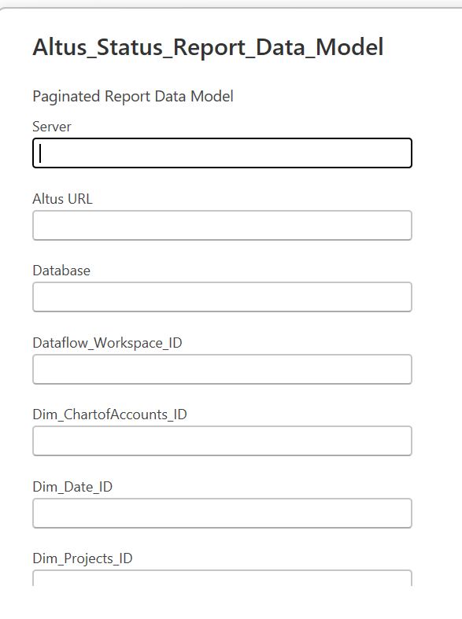
- Open the __Transform Data__ view 
- Click __Data source setings__ and update your credentials:
  - Click on the Dataflow item from the list, then __Edit Permissions__ and log in to the environment even if it says you're already signed in
  - Click on the environment link and follow the above process to log in to the environment
- Save and Test the Data Model
-	Upload the report into the Power BI Workspace
- Make sure the Data source credentials are correct
- Set a Refresh Schedule for this report. (Hourly throughout the day, on a staggered schedule to the Dim_Project Data flow)

### Connecting the Project and Program reporting files in the client environment

Download each of the report templates:
  - [ Altus 1-page Project Status Report](Archive/Altus_PSR_1page.zip)  
  - [ Altus 1-page Project Status Report - similar to Status Update page](files/Altus_1-page-Project_Status_Report.zip)
  - [ Altus Project Status Report (Portrait)](Archive/Altus_Project_Status_Report_Portrait.zip)
  - [ Altus Project Status Report (Landscape)](files/Altus_Project_Status_Report_Landscape.zip)
  - [ Altus Program Status Report (Portrait)](files/Altus_Program_Status_Report_Portrait.zip) 
  - [ Altus Portfolio Status Report (Landscape)](files/Altus_Portfolio_Status_Report_Landscape.zip)   <p>

  __NOTE:__ These files are zipped when you download them. You will need to unzip them to be able to use them.

- Open each of the reports in the __Power BI Report Builder__. 
- Sign into the client environment in the Report Builder.
- Create a link to the new Dataset in __Data > Power BI Dataset__, do not create a new dataset when the system prompts you to. Cancel out of the Dataset Properties window.
- Open each of the Datasets in the report, using the __Dataset Properties__ option, and Update the __Data Source__ to the new Data Source.
- Test the report.
- Delete the old __Data Source__ from the report.
- Upload the report into the Power BI Workspace.

### Embedding the reports in a tab on the Project/Program/Portfolio

For each report (e.g., Project Landscape, Project Portrait, etc) that needs to be embedded the following artifacts will need to be created.

1. A configuration setting to contain the Report URL.
2. A web resource to iframe the report.

#### Configuration Setting

To create a configuration setting, following the below steps.

1. Navigate to Settings => System Configuration => Configuration Settings
2. Create a new record using __+ New__
3. Fill in the information.
   1. Category: __Power BI__
   2. Display Name: __XYZ SSRS Config Setting__
   3. Name: __XYZ_SSRS_Config_Setting__
   4. Description: *Optional*
   5. Value: The report embed link for the report.

The report embed link can be found by visiting the report to be embedded in the Power BI workspace.

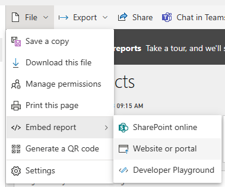

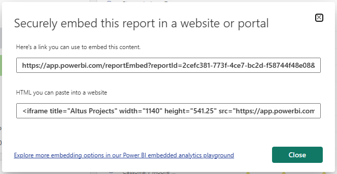

The final configuration setting should look similar to that of the one below.

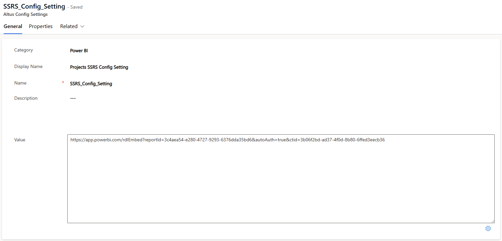

#### Web Resource

Use the following web resource template:

```
<html><head><style data-merge-styles="true"></style>
    <script src="sensei_SenseiProject.bundle.js" type="text/javascript"></script>
    <script>
       function getQueryStringFilter(context) {
           const id = parent.Xrm.Page.data.entity.getId().replace(/[{}]/g,'');
           return `&rp:DimProjectProjectName=${id.toLowerCase()}`;
       }
       function loadIframe() {                                                    
           sensei_SenseiProject.Generic.IFrameService.Instance.setIframeSource("SenseiPowerBIIframe", "SSRS_Config_Setting", getQueryStringFilter);
       }
    </script>
    <meta>
    <meta>
    <meta>
 </head>
 <body onload="loadIframe()" onfocusout="parent.setEmailRange();" style="overflow-wrap: break-word;">
    <iframe id="SenseiPowerBIIframe" width="100%" height="100%" src="" frameborder="0" allowfullscreen="true"></iframe>
 </body>
</html>
</iframe></body></html>  
```
Within the template replace __SSRS_Config_Setting__ with the setting [defined](#configuration-setting) and change the QueryStringFilter accordingly.

- Projects = ``` `&rp:DimProjectProjectName=${id}` ``` which is your parameter name in the rdl file.
- Programs = ``` `&rp:DimProgramsenseiprogram=${id}` ``` which is your parameter name in the rdl file.

Once these changes have been made, create a new web resource within your solution and upload this file.

#### Embedding

##### Paginated Report (.rdl files)

If the client wishes to have both landscape and Portrait then the portrait rdl file can be found in Archive folder.

To embed a paginated report navigate to make.powerapps.com. Then go to Solutions –  Eg:Customised Altus solutions or Power BI Solutions or create a new Solution if you want to keep it separate for Power BI Reports.

Then navigate to the solution and click on New – More- Web resource.

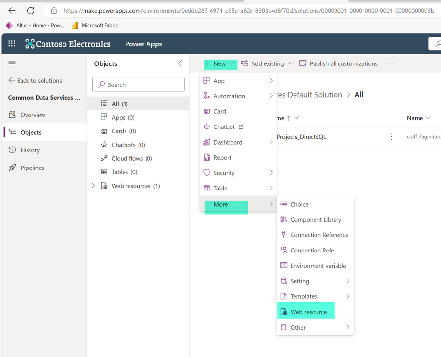

Choose the new html file you created and fill in the details like shown below

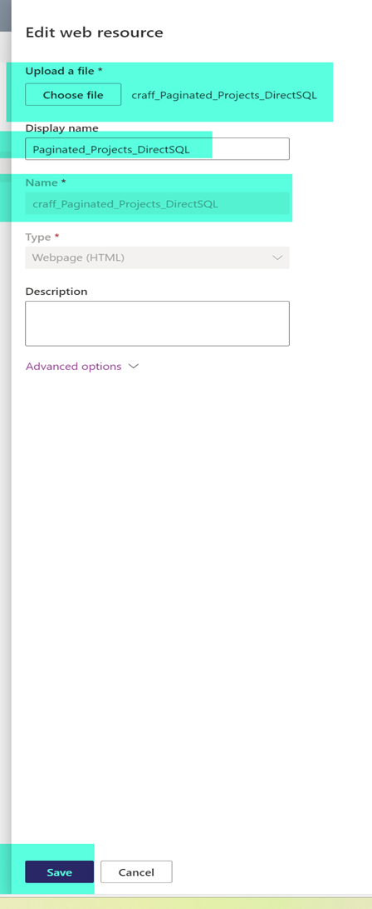

Then add existing table like shown below

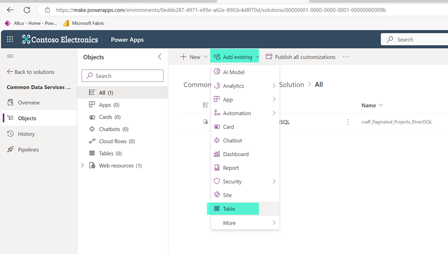

If its Project report then choose Project , if its Portfolio choose Portfolio and if its Program then choose Program like shown below:

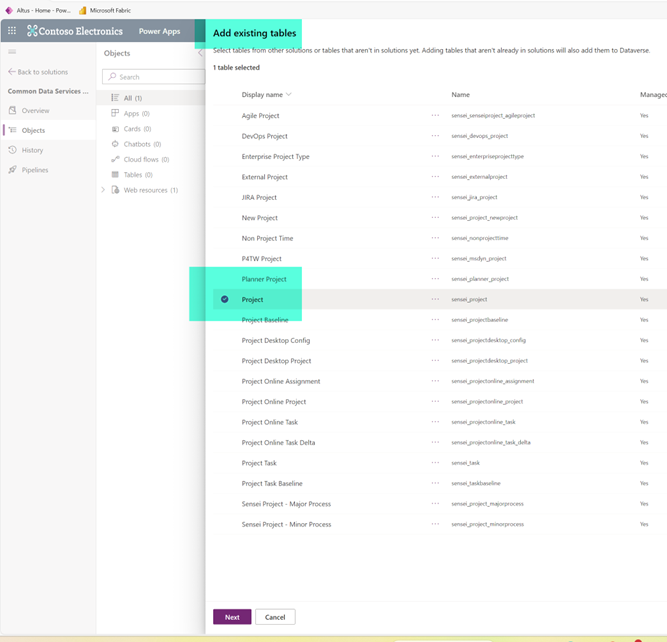


Check include table metadata checkbox and choose select objects

Navigate to select objects and  choose tracking under Forms if you want to embed the report under Tracking

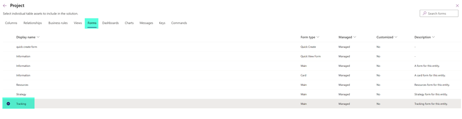
Click on add and then its saved under solutions.

Navigate to Project and then go to forms and edit in New tab


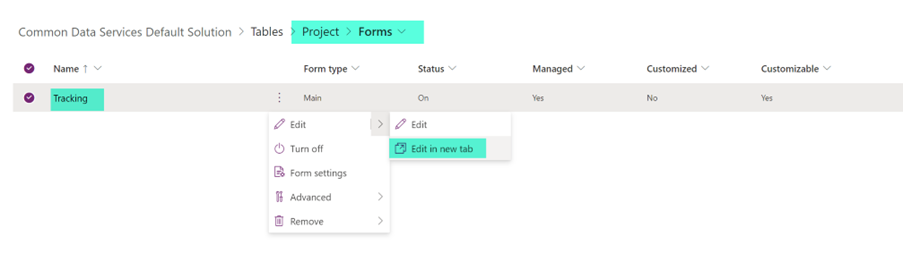

Click on Show hidden and then go to Components and add 1 column tab

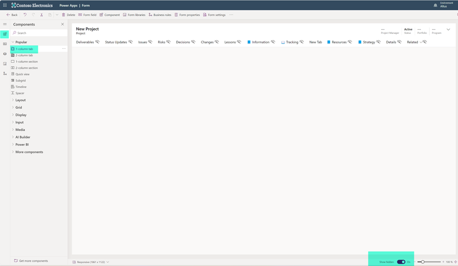

Rename the tab and then go to Display and then add new HTML web resource that was created in previous step

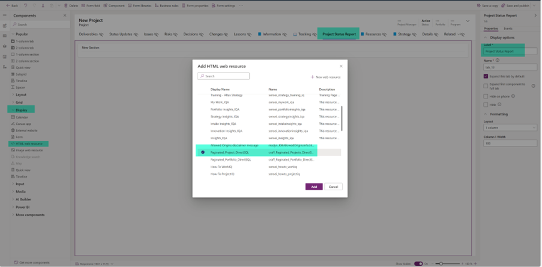
Click on Add

Final step should like below
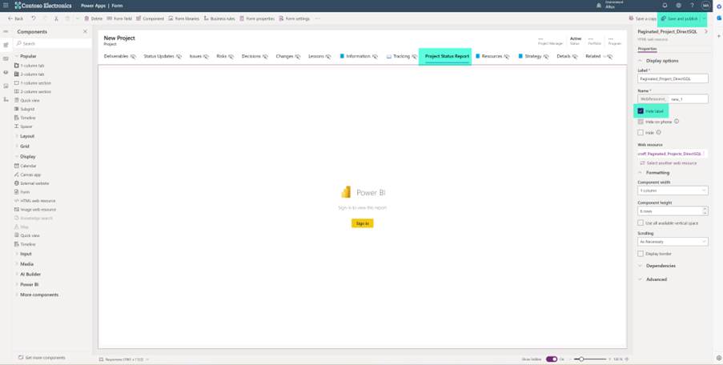

Click on save and publish.

After few minutes you can see the new embedded report inside Altus.


