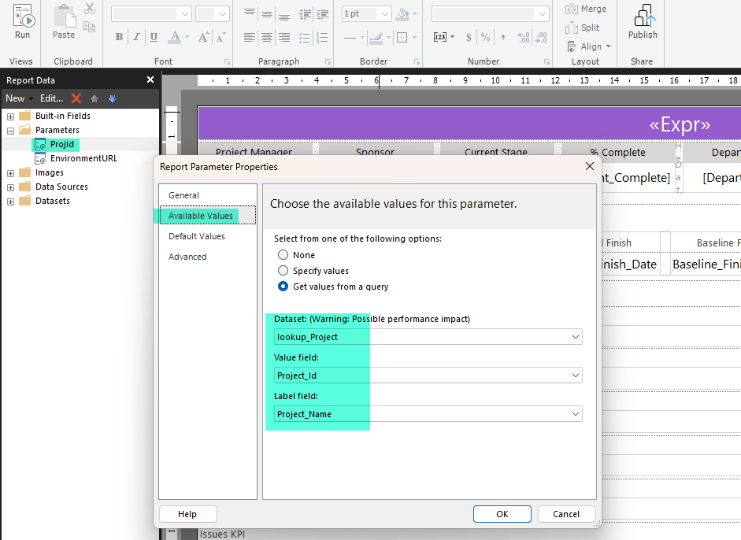
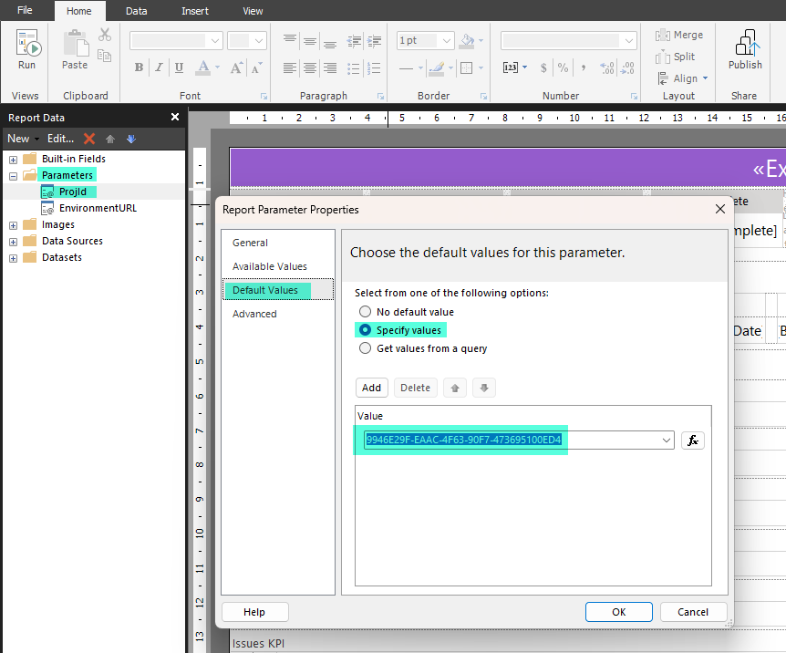
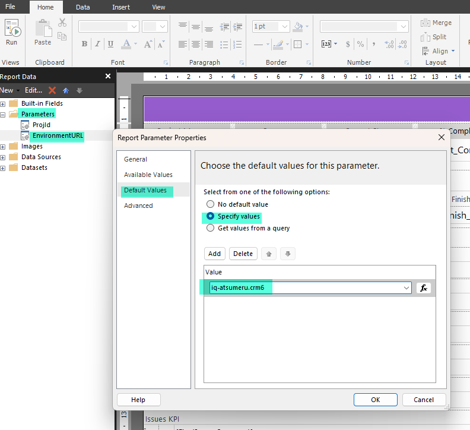
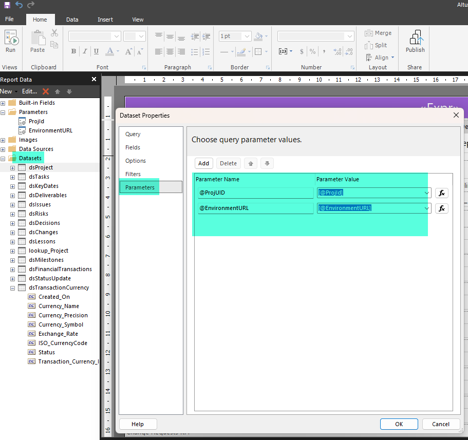
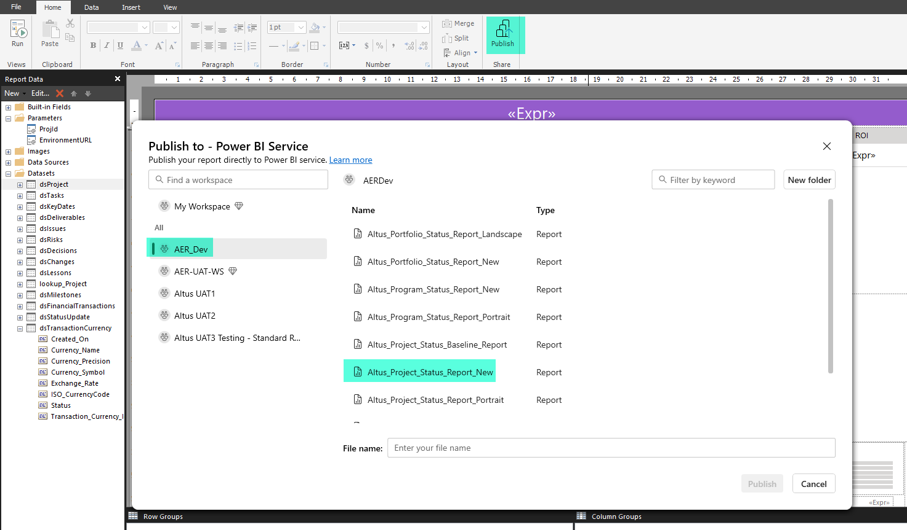

# Paginated Reports Solution Starters

Paginated reports have been created to compliment Altus installation to generate status reports for projects, program and portfolio.

These reports are .rdl files and have been developed using the Power BI Report Builder. It has direct SQL connection to Dataverse which contains Altus data. This is then published to Power BI Service as .rdl file.

## Reports

### Project Status Reports

Project status report contains following information:

-  Project info and Project status like General KPI, Deliverables KPI, Schedule KPI, Financials KPI, Work KPI, Issues KPI, Risks KPI, Change Requests KPI and Project Progress and Effort pie chart
- Financials - EAC by Financial Category line chart and Cost by Month bar chart, Category Costs and Financials
- Milestones and Key Dates
- Deliverables
- Issues
- Risks
- Decisions
- Change Requests
- Lessons Learned

 rdl file can be downloaded from - [Download .rdl file for Project Status Report](./files/Project_Status_Report/Reports/Altus_Project_Status_Report.zip)

#### Datasets 
There are 14 datasets for Project status report which are direct SQL queries:
    
    dsProject
    dsTasks
    dsKeyDates
    dsDeliverables
    dsIssues
    dsRisks
    dsDecisions
    dsChanges
    dsChanges
    dsChanges
    dsLessons
    lookup_Project
    dsMilestones
    dsFinancialTransactions
    dsStatusUpdate
    dsTransactionCurrency

SQL Files which are used for datasets can be downloaded from - [Download SQL Code for Project Status Report](./files/Project_Status_Report/SQL/Project_Status_Report_Dataset_SQL_Code.zip)

#### Parameters 
- __Project Id__ - parameter that will be passed for most of the datasets. This will be hidden in the reports and when embedded in Altus it fetches the project that is currently open in Altus and passes the id as paramater

### Program Status Reports
Program status report contains following information:

- Program Info and Program Status like General KPI, Deliverables KPI, Schedule KPI, Financials KPI, Work KPI, Issues KPI, Risks KPI, Change Requests KPI and Program Progress and Project Effort pie chart
- Associated Project Financials - EAC by Financial Category line chart and Cost by Month bar chart, Category Costs and Financials
- Program Key Dates
- Program Issues
- Program Risks
- Program Decisions
- Program Change Requests
- Program Lessons Learned
- Associated Project Summary

rdl file can be downloaded from - [Download .rdl file for Program Status Report](./files/Program_Status_report/Reports/Altus_Program_Status_Report.zip)

#### Datasets   
There are 18 datasets for Project status report which are direct SQL queries:

    dsProject
    dsKeyDates
    dsIssues
    dsRisks
    dsDecisions
    dsChanges
    dsLessons
    lookup_project
    dsFinancialTransactions
    dsStatusUpdate
    lookup_Program
    dsProgram
    dsStatusUpdate_Project
    dsIssues_Project
    dsRisks_Project
    dsDecisions_Project
    dsChangeRequest_Project
    dsTransactionCurrency

SQL Files which are used for datasets can be downloaded from - [Download SQL Code for Program Status Report](./files/Program_Status_report/SQL/Program_Status_Report_Dataset_SQL_Code.zip)

#### Parameters 

- __Program Id__ - parameter that will be passed for most of the datasets. This will be hidden in the reports and when embedded in Altus it fetches the program that is currently open in Altus and passes the id as parameter

### Portfolio Status Reports

Program status report contains following information:

- Portfolio Info and Portfolio Summary like Description, Justification, Stakeholder Communications and Vision
- Portfolio Key Dates
- Portfolio Risks
- Portfolio Decisions
- Portfolio Change Requests
- Summary - Associated Projects and Programs linked to projects
- Associated Project and Program Issues
- Associated Project and Program Risks
- Associated Project and Program Decisions
- Associated Project and Program Change Requests

rdl file can be downloaded from - [Download .rdl file for Portfolio Status Report](./files/Portfolio_Status_Report/Reports/Altus_Portfolio_Status_Report.zip)

#### Datasets 

There are 16 datasets for Project status report which are direct SQL queries:

    dsProject
    dsKeyDates
    dsRisks
    dsDecisions
    dsChanges
    lookup_Project
    dsFinancialTransactions_Portfolio_Project
    lookup_Portfolio
    dsPortfolio
    dsStatusUpdate_Project
    dsIssues_Project_Program
    dsRisks_Project_Program
    dsDecisions_Project_Program
    dsChangeRequest_Project_Program
    dsStatusUpdate_Program
    dsTransactionCurrency

SQL Files which are used for datasets can be downloaded from - [Download SQL Code for Portfolio Status Report](./files/Portfolio_Status_Report/SQL/Portfolio_Status_Report_Dataset_SQL_Code.zip)

#### Parameters 

- __Portfolio Id__ - parameter that will be passed for most of the datasets. This will be hidden in the reports and when embedded in Altus it fetches the portfolio that is currently open in Altus and passes the id as parameter

### KPIs for Reports

[Download KPI Info file if further information required](./files/Paginated_Reports_KPI.xlsx)

## Installing the Reports in a Client's environment

### PowerBI Updates

#### Project Status Report
1. Open the .rdl file which you have downloaded from the above steps and navigate to parameters like shown below:

    
 
    Make sure that the dataset, value and label field matches with your dataset

2. Navigate to default values like shown below and add the default value as any projectid from your clients environment. This is optional.

    

3. Navigate to parameters and then to EnvironmentURL and add a default value that should be your clients environment. See below for example

    

4. Make sure all the datasets have the correct parameters chosen if you have made any updates to the name of the parameter. 

    

5. Save the .rdl file.

6. The above steps need to be done for all three status reports - Project, Program and Portfolio status reports.

### Publishing it to PowerBI Service

1. Open the .rdl file and once you have made all the necessary changes to the parameters then you will need to publish it to Power BI service in your clients environment.

2. If your clients environment already have Power BI Standard reports then you can use the same workspace. Otherwise a new workspace need to be created.

3. Publish the .rdl file (paginated report) to the workspace. See below example.

    

## Embedding inside Altus

[Download Instructions for embedding inside Altus](./files/Embedding_Paginated_Reports.docx)