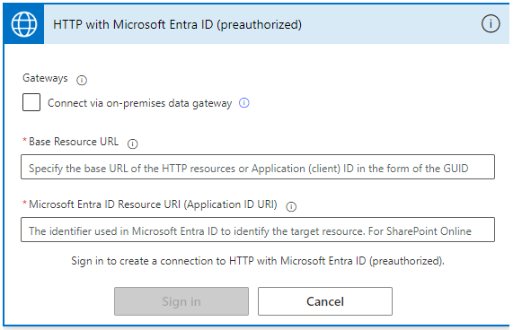
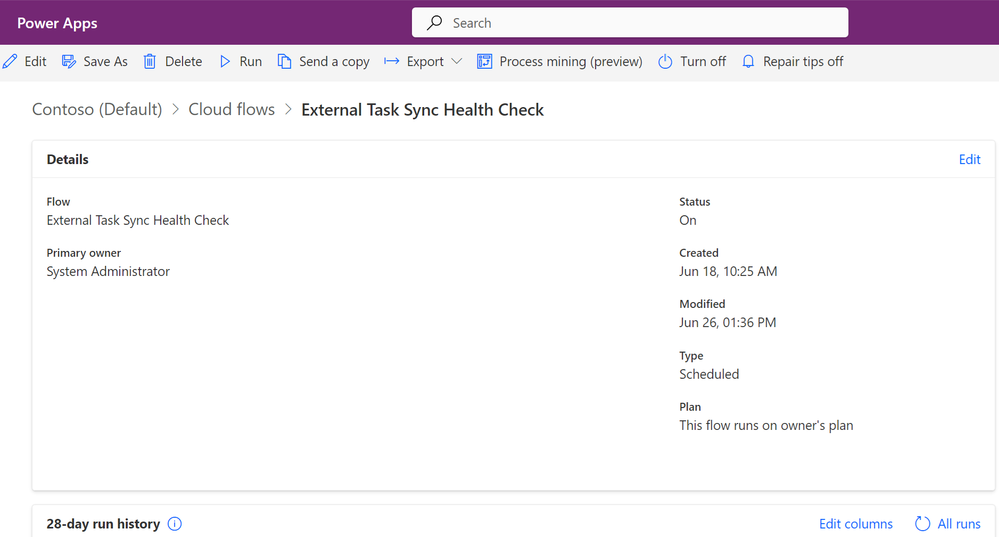

[Download External Task Sync Health Check Flow solution](ExternalTaskSyncHealthCheck_1_0_0_11.zip)

## Flow steps:

The External Task Sync Health Check Flow will identify (and optionally fix) 5 scenarios where externally linked project tasks have come out of alignment.
1. Altus Project is aligned to an external project record but the sensei_externalprojectid value on the sensei_project record is null. When executed, the Flow will re-populate the sensei_externalprojectid value on the Altus Project.
2. Altus Project is not aligned to an external project, but still contains tasks which have external task ids and field locks. When executed, the Flow will Delete or Unlink these tasks (dependent on the DeleteOrphanTasks variable in the Flow). 
3. Altus Project is aligned to an external project, but contains tasks which reference external ids which do not exist in either the external task table or the task sync table. When executed, the Flow will delete these tasks.
4. Altus Project is aligned to an external project, but there are external tasks which do not have a corresponding Project Task or a reference to the Altus Project. When executed the Flow will populate the Lookup to the Project on the External Task record and trigger creation of the Project Task.
5. Altus Tasks have an external task id, but no external task record referring back to that task can be found, identifying it as a duplicate. When executed, the Flow will delete the duplicate tasks.

This Flow can be run daily as an overnight repair job, or on an ad-hoc basis as required.

The Flow run time will be dependent on the amount of data that is being repaired.   

Please note that the Do While loop that processes each of the execute actions has a default timeout of 60 minutes. If the processing time for batches within that loop reach 60 minutes then the remaining items from that collection will not be processed in that Flow run (but should complete the next time the Flow is run). 

## Install Instructions

**Note** - Recommended to run this process in a private browser session, as the connection wizard can get confused about which environment to authenticate against.

- Please take the unmanaged solution .zip supplied, and import it into the environment it will run.
  - **Note** - this must be installed as unmanaged, as otherwise the parameters may not be modified.

- Create the two connections, and ensure green ticks appear on the Flow overview page. Note that the Solution import process may attempt to re-use existing connections of the same type. Ensure that if you are re-using exising connections that they are pointing to the same environment - so as to not get unexpected results. 
- Enter the environment base URL in both text fields for the HTTP with Entra ID connection,  
  e.g., `'https://iq-atsumeru.crm6.dynamics.com/'`

### Open the Flow in edit mode

- Change the recurrence settings to match your preferences. (If choosing to run it ad-hoc, simply use the option to turn the Flow off when not in use)
- Change the 'Environment URL' variable to be the base environment URL.
- The WillExecuteChanges variable has a default value of 'false'. When set to false, the Flow will run to identify any misaligned data but will not make any changes. Instead the 'Execute or Output' Scopes will use a Compose action to display the data that would otherwise be passed through to execution. To switch to execute mode, change the value of the WillExecuteChanges variable to true.
- The DeleteOrphanTasks variable has a default value of 'false'. When set to false then for Scenario 2, the Flow will *Update* any identified orphan tasks to remove the external links (making them native Altus tasks). When set to true, then for Scenario 2, the Flow will *Delete* any identified orphan tasks. Note that this variable has no impact on the behaviour of Scenario 3 or scenario 5 (in that scenario, tasks will always be marked for delete).
- The MaxBatchSize variable can be adjusted, but must not ever exceed 1000 (this is the maximum batch size allowed by Dataverse).

- Save the changes

Please note that the HTTP action to send high level telemetry (number of records affected) to Application Insights for Altus is included to assist in ensuring that Altus gain insight as to how many records are affected by task sync misalignment in customer environments. This action can be optionally deleted if required.
