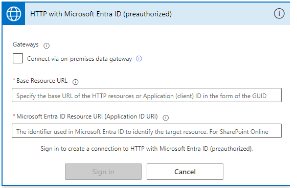
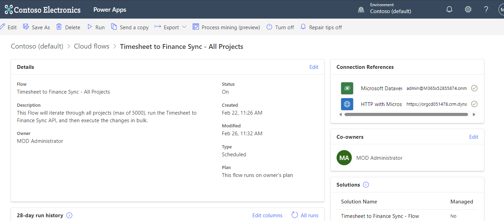

[Download Timesheet to Finance Sync Flow solution](TimesheettoFinanceSyncFlow_1_0_0_4.zip)

## Flow steps:

- Get a list of all projects (your team can add a filter as needed)
- For each project, get the financial adjustments by calling the shipped API we use in the Finance import UI (currently in First Release)
- Aggregate the updates
- Then, using the DataVerse batch API, process the changes in the appropriate order

Our largest test processed over 1000 projects in around an hour and a half and is designed to be run daily, ideally overnight.

The critical aspect of the updates contained is projects cannot be updated concurrently by multiple triggers, this as we found with the multi-approval live import can cause data corruption. Otherwise, you can break up the projects how you want.

## Install Instructions

**Note** - Recommended to run this process in a private browser session, as the connection wizard can get confused about which environment to authenticate against.

- Please take the unmanaged solution .zip supplied, and import it into the environment it will run.
  - **Note** - this must be installed as unmanaged, as otherwise the parameters may not be modified.

- Create the two connections, and ensure green ticks appear on the Flow overview page.
- Enter the environment base URL in both text fields for the HTTP with Entra ID connection,  
  e.g., `'https://iq-atsumeru.crm6.dynamics.com/'`

### Open the Flow in edit mode

- Change the 'Environment URL' variable to be the base environment URL.
- Change the recurrence settings to match your preferences.
  - **Note** - Once a day is recommended, but feel free to experiment with shorter times. Make sure the recurrence time well exceeds the longest expected execution time to avoid overlapping results.
- Save the changes
